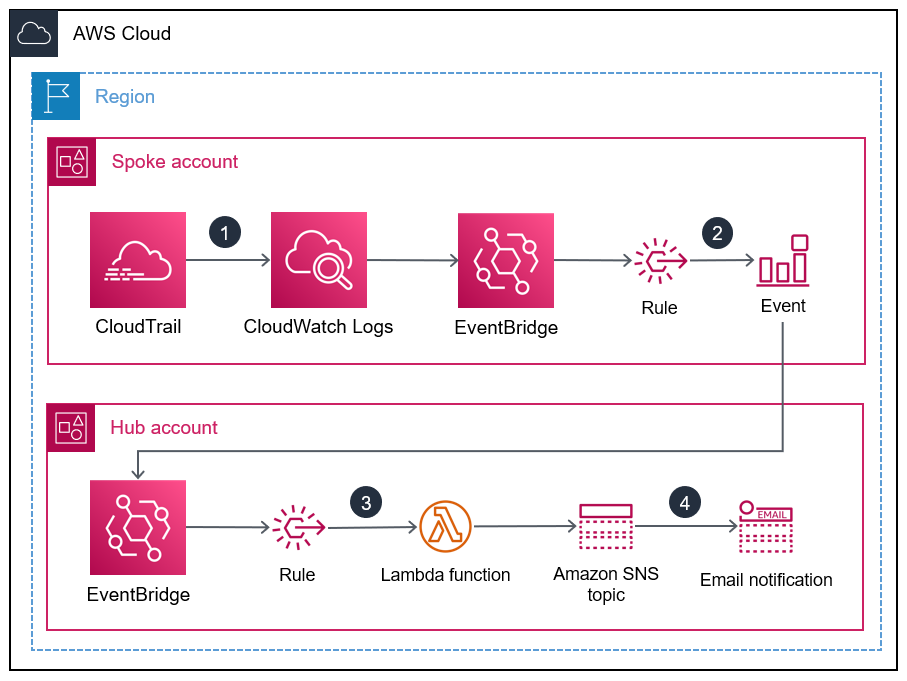

# AWS IAM Root User Activity Monitor

## Introduction

This user guide addresses architectural considerations and configuration steps for deploying the AWS IAM Root User Activity Monitor implementation on the AWS Cloud. It includes the Infrastructure as Code templates that launch, configure, and run the services required to deploy this implementation on AWS, using security and availability best practices.
This guide is intended for IT managers, security engineers, DevOps engineers, developers, solutions architects, and SysOps administrators.

## Purpose of the document

This document describes (1) a sample set of requirements in terms of AWS IAM root user activity monitoring in the AWS Cloud, (2) the technical architecture implemented to meet them and (3) the steps to deploy and use it.

## Initial requirements

This implementation is intended to:

* Monitor the AWS IAM root user activity in the AWS cloud.
* Deploy monitoring capabilities in a multi-account setup. 
* Centralize the monitoring in one AWS account.

## Proposed implementation

The proposed implementation is [event-driven](https://aws.amazon.com/event-driven-architecture/) and relies on [Amazon EventBridge](https://aws.amazon.com/eventbridge/) to communicate AWS IAM root user activity events from member accounts to a central EventBridge custom event bus deployed in a given account that we will call `Hub account`.
1. Hub account component contains a Terraform template to deploy the following resources :
    * EventBridge custom event bus to centralize the events received from member accounts.
    * AWS Lambda function (AWS IAM role, Lambda function permission and Lambda function code in compressed in `zip` format).
    * Amazon Simple Notification Service (SNS) topic.
2. Member accounts component is an AWS CloudFormation StackSet template to deploy the following resources : 
    * EventBridge event-based rule to capture the IAM root user activity based on integration between AWS CloudTrail and AWS CloudWatch Logs.
    * Event delivery IAM role for EventBridge to be able to send events to the central custom event bus.

## Technical architecture of the implementation

The diagram below illustrates the building blocks of the implementation.



## Deployment

### Prerequisites
1. Permissions to deploy AWS resources into your AWS environment.
2. [Terraform by HashiCorp](https://www.terraform.io/downloads.html) to deploy resources in the Hub account.
3. Permissions to deploy AWS CloudFormation StackSets and CloudFormation StackSets instances.

### How to deploy
The implementation is composed of :
* A Terraform template containing resources to be deployed in the Hub account.
* A CloudFromation template to be deployed as a stack set instance in member accounts.

Once cloned, the overall repository's structure is the following:
```
.
|__README.md
|__spoke-stackset.yaml
|__hub.tf
|__root-activity-monitor-module
    |__main.tf  # contains terraform code to deploy resources in the Hub account
    |__iam      # contains IAM policies JSON files
        |__ lambda-assume-policy.json          # contains trust policy of the IAM role used by the Lambda function 
        |__ lambda-policy.json                 # contains the IAM policy attached to the IAM role used by the Lambda function
    |__outputs  # contains Lambda function zip code
```

It is necessary to deploy in the following order:

1. The template in the account **HUB** using Terraform.
2. The template `spoke-stackset.yaml` in the member accounts using CloudFormation StackSets.


To deploy the implementation in the **HUB** account:
1. Clone the repository to a local folder.
2. Update the following inputs in `hub.tf`:
    * `OrganizationId` : add your OrgId (`o-<...>`) here (AWS Management Console -> Organizations -> Settings or using AWS CLI with required permissions: `aws organizations describe-organization --query "Organization.Id"`)
    * `SNSTopicName`: add the SNS topic name.
    * `SNSSubscriptions`: add your email here to be able to receive notifications.
    * `region`: add the AWS region code where resources will be deployed, for instance, `eu-west-1` for Ireland region.
    * `Tags`: add your tags here.
3. If you're not using Terraform Enterprise, ensure that you have required permissions to deploy resources to the **HUB** account.
4. Run `terraform init && terraform plan`
5. Review the output and resources to be created.
6. Run `terraform apply` and confirm the deployment by entering `yes` when asked.

To deploy the implementation in the member accounts:
1. Log into your AWS Management account from which you will deploy the [CloudFormation StackSet instances](https://docs.aws.amazon.com/AWSCloudFormation/latest/UserGuide/stacksets-getting-started-create.html).
2. Go to the AWS CloudFormation console at https://console.aws.amazon.com/cloudformation.
3. From the navigation pane, choose **StackSets**.
4. At the top of the StackSets page, choose **Create StackSet**.
5. Under **Prerequisite - Prepare template**, choose **Template is ready**.
6. Under **Specify Template** choose **Upload a template file** and click on **Choose file** then browse and select the file `spoke-stackset.yaml` from where you cloned the respository.
7. Choose a `name` for the stack set.
8. Enter the **HUB** `account-id` and choose **Next**.
9. Specify the right permissions to deploy the stack set and where (Accounts or Organizational Units & regions) to deploy it then choose **Next** followed by **Execute**.

### How to test
If you want to test the implementation you should deploy it and then connect to a member account or the **HUB** account using root user credentials. You should receive a notification alerting you about this activity.

## Security

See [CONTRIBUTING](CONTRIBUTING.md#security-issue-notifications) for more information.

## License

This implementation is licensed under the MIT-0 License. See the LICENSE file.

